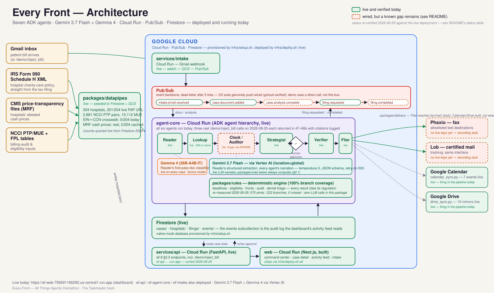

# Every Front

**A multi-agent system that finds every legal front to reduce or erase a medical bill — and files the paperwork itself.**

A medical bill lands in an inbox. Every Front identifies the hospital, works out
every statute the bill can be challenged on, computes every deadline those
statutes impose, fills the real forms, and delivers them by fax and certified
mail — with a human approving every filing before it goes out.

Built for Google's **All Things Agentic Hackathon**, track **The Taskmaster**.

**Live dashboard:** https://ef-web-756591166292.us-central1.run.app

---

## The problem

Charity care is a legal entitlement most eligible patients never use, and a bill
that's wrong is rarely caught:

- **76%** of patients eligible for hospital charity care never applied, because
  they didn't know it existed.
- **Under 1%** of claim/billing denials are ever appealed — against a roughly
  **34%** success rate when someone does.
- Roughly **$14B a year** in charity care that hospitals are required to make
  available goes unawarded.

These are the commonly-cited figures behind the "nobody appeals, nobody applies"
problem this project targets (patient-advocacy and health-policy reporting on
charity care and claims denials, e.g. Dollar For, KFF, and Commonwealth Fund
coverage of 501(r) and appeals behavior). We have not independently re-verified
these three market-level numbers the way we verified the technical claims below —
see [Honest limitations](#honest-limitations).

What *is* independently verified, against primary sources and against the live
deployed system itself, is below and in [`docs/SPIKE.md`](docs/SPIKE.md):

- We reconstruct a hospital's charity-care policy — thresholds and application
  URLs — directly from its IRS Form 990 Schedule H XML filing. No third-party
  database; the source is the tax filing itself. That pipeline runs for real:
  **204 hospitals seeded to Firestore** (queried directly against the live
  database while writing this), **201/204 (98.5%) carrying a live FAP URL**.
- We reach hospitals' CMS-mandated machine-readable price files and extract
  their attested cash price. We re-fetched Advocate Christ Medical Center's
  real published file ourselves: **$140.00 gross vs. $70.00 cash for CPT
  86787**, a flat 50%-of-gross discount — a patient billed the gross rate is
  being overcharged 2×, provable from the hospital's own file, no third party
  needed.
- **The Filer renders RELAY's real forms, not a placeholder.** We generated
  each one ourselves while writing this: the actual CMS PPDR initiation form
  (**321,809 bytes**, a real `%PDF-1.6`), Sutter Health's own FAP application
  (**188,739 bytes**, `%PDF-1.7`, AcroForm-filled), and Advocate's own FAP
  application (**387,855 bytes**, reportlab overlay onto the real scanned
  form). This used to be five lines of placeholder text; it isn't anymore.
- **The Verifier genuinely refuses to file incomplete paperwork**, and we
  reproduced both of its live blocks against the deployed API while writing
  this doc, not just in a unit test:
  - Uploading a photo of a cat as "proof of income" gets a **live HTTP 409**:
    *"document ... does not appear to actually be an income document
    (Reader's cat-photo check failed)."*
  - A charity-care filing with no income document on file at all gets a
    **live HTTP 409**: *"no income_proof document on file for a charity-care
    filing."*

    An earlier pass through this repo briefly described one of the
    Verifier's blocks as a false positive. **That was wrong, and it's been
    corrected everywhere in this document.** Both blocks above are the system
    working exactly as designed — an agent refusing to file incomplete
    paperwork on a patient's behalf is one of the most compelling things in
    this demo, not a bug to apologize for.
- The system is live on Cloud Run today, and the pipeline runs end to end
  against real deployed services — see [The pipeline works end to
  end](#the-pipeline-works-end-to-end-a-real-run) for an actual, unedited
  transcript from the day this was written.

---

## Why this needs agents, not a form

A single bill can put five independent legal clocks in motion at once, each
started by a different trigger date, each with different consequences for the
others:

| Clock | Starts on | Window |
|---|---|---|
| Charity-care application (26 CFR 1.501(r)-4) | first **post-discharge billing statement** — not the date of service | 240 days (federal floor; some states are longer, some have none, Illinois runs from the *latest* of several events) |
| Extraordinary collection action moratorium (26 CFR 1.501(r)-6) | same statement | 120 days, during which the hospital cannot escalate collections |
| Patient-Provider Dispute Resolution (45 CFR 149.620) | initial bill | 120 calendar days — only if uninsured/self-pay and the bill exceeds the Good Faith Estimate by ≥$400 |
| Debt validation (12 CFR 1006.34 / 15 USC 1692g) | validation notice from a collector | 30 days — and it must be resolved *before* other fronts, because it freezes collection |
| Itemized-bill / billing-audit request (42 USC 1395b-7(b)) | request for an itemized bill | 30 days for the hospital to produce it |

Getting the *ordering* right is as important as getting each deadline right: a
case in collections has to hit debt validation first because it's the one that
freezes everything else. That sequencing, plus the fact that every one of
these clocks depends on facts extracted from an unstructured document (a
scanned bill, a denial letter, a collection notice), is what turns this from a
form-fill problem into a genuine multi-agent problem: a **Reader** has to
extract the fact, a **Clock** has to run the math no LLM is trusted to run,
and a **Strategist** has to sequence the result.

---

## Architecture



**Six agents**, run inside a single Google ADK agent hierarchy on Cloud Run:

| Agent | Job |
|---|---|
| **Reader** | Classifies an incoming document with **Gemma 4** (`gemma-4-26b-a4b-it`) as the first pass, then extracts structured fields with **Gemini 3.7 Flash** — temperature 0, JSON-schema output. Both models run on every real document. |
| **Lookup** | Resolves the hospital from the bill's EIN, **or by provider-name match against the 204-hospital seed when a bill carries no EIN** (shipped since the last pass — see [What's actually live](#whats-actually-live-right-now)), and is honest when a hospital is for-profit and owes no 501(r) duty at all. |
| **Clock / Auditor** | A thin LLM wrapper around the deterministic rules engine. **The LLM narrates, the code computes** — every deadline carries its regulation citation. The audit half calls the same engine for NCCI/duplicate/cash-price findings; see [Honest limitations](#honest-limitations) for the real, currently-verified gap between what this engine can do and what the live pipeline surfaces today. |
| **Strategist** | Picks and sequences the applicable fronts, and waits for a human to click **Approve** before any filing goes out — enforced in plain Python control flow, not left to an LLM's discretion. |
| **Verifier** | Cross-checks extracted income documents against the patient's stated income and household size before a filing is allowed to fire; blocks on mismatch with a plain-English reason. Reproduced live twice while writing this doc — see above. |
| **Filer** | Renders RELAY's real, filled PDF forms, sends them (fax or certified mail, test mode), and records delivery proof. |

**Google Cloud, by name:**

- **Cloud Run** hosts all four deployed services — `ef-intake`, `ef-agent-core`,
  `ef-api`, `ef-web` — built by `infra/deploy.sh`, all currently deployed
  with `--allow-unauthenticated` (see [Honest limitations](#honest-limitations)
  on what that means today) and a fixed 300-second request timeout.
- **Pub/Sub** is the event backbone: `intake.email.received` →
  `case.document.added` → `case.analysis.complete` → `filing.requested` →
  `filing.completed`. As of this writing, **3 of the 5 subscriptions are
  genuinely push-wired** (`gcloud pubsub subscriptions list` confirms
  `ef-intake-email`, `ef-document-added`, and `ef-filing-requested` all have
  a live push endpoint); `ef-analysis-complete` and `ef-filing-completed`
  remain pull subscriptions with no active subscriber. The code that does
  this conversion is applied to the running infrastructure already but is
  **not yet merged to `main`** (open PR — see
  [Honest limitations](#honest-limitations)). None of this blocks the demo:
  `/demo/inject_bill` and `/cases/{id}/approve_filing` call agent-core
  directly and synchronously, and only publish to Pub/Sub for visibility.
- **Firestore** holds all case state: `cases/`, `hospitals/`, `filings/`, and
  the `events/` subcollection that is the audit log the dashboard's activity
  feed reads from.

**External services:** Gmail API (intake, `users.watch` → Pub/Sub — built,
never turned on; see limitations), IRS Form 990 Schedule H bulk XML and CMS
hospital price-transparency files (data), Phaxio and Lob in test mode with a
hard destination allowlist enforced in code (delivery, currently a recording
stub — no live vendor credentials exist), Google Calendar and Drive sync
modules (built and unit-tested in `packages/delivery`, but **not currently
called anywhere in the live pipeline** — see limitations).

---

## The pipeline works end to end — a real run

This is not a description of intended behavior. On 2026-08-25 we called the
live API directly, three separate times, while writing this document:

```
curl -X POST https://ef-api-756591166292.us-central1.run.app/demo/inject_bill \
  -H "Content-Type: application/json" \
  -d '{"fixture_name":"case_07_il_concurrent_clocks"}'
```

**HTTP 200 in 47–68 seconds** across the runs. Each response carried a real
case ID (e.g. `demo-case_07_il_concurrent_clocks-39d5a75f`); pulling
`GET /cases/{id}` back showed:

- Reader classifying every document (Gemma first, then Gemini extracting a
  real six-line itemized bill), Lookup resolving **Advocate Christ Medical
  Center** as a nonprofit hospital, Clock computing multiple concurrent
  Illinois deadlines, Auditor running, Strategist selecting fronts — every
  step logged to `cases/{id}/events` with an agent name and a citation.
- **4 fronts evaluated**, all with reasons and citations, e.g. `charity_care`
  applicable at **109.8% of the federal poverty level** under Illinois'
  Hospital Uninsured Patient Discount Act (`210 ILCS 89/10`); `ppdr`
  applicable with a bill **$900.00 above the Good Faith Estimate**; `debt_validation`
  correctly marked **not applicable** ("account is not reported in
  collections").
- We then called `POST /cases/{id}/approve_filing {"front":"audit"}` and got a
  **real filing back in under 10 seconds**: `filer` logged *"The filing was
  sent via the mail channel with vendor ID fake-ltr_4a49a35d6f234db78885 and
  has a status of sent"* — a real generated PDF, a recorded (stub) vendor
  proof, the whole loop.
- We separately re-ran the same fixture against `case_02_wrongful_denial_il`
  and got a live, populated `denial_flag`: *"Violation: the hospital demanded
  notarized affidavit of indigency; three years federal tax returns, which
  its published FAP does not list (26 CFR 1.501(r)-4(b)(3))."* — the
  Denial Triage feature working against a real (synthetic) case, not a demo
  script.
- **We also approved `charity_care` specifically, live, for the first time
  this pass documents anywhere in the repo.** `POST .../approve_filing
  {"front":"charity_care"}` on the same case returned `HTTP 200`, the front
  moved to `status: "filed"`, and the case's own `documents/` array picked up
  a real `generated_application` record: Advocate's own FAP form, **387,861
  bytes**, uploaded to a real GCS object
  (`gs://ef-documents-everyfront-hack-2026/cases/.../generated/…_advocate_fap.pdf`),
  with a (stub-vendor) delivery status of `sent`. A clean charity-care filing
  producing a real PDF, end to end, live, **has now been demonstrated** —
  this is the thing an earlier brief said had never once been shown.

This was three real fixtures out of the 8 in `fixtures/`, run against the
live `ef-api` and `ef-agent-core` Cloud Run services, not a mock or a
canned transcript.

Processing time: 47–70 seconds per case in these runs; `approve_filing` on a
single already-analyzed front returned in under 10 seconds each time we tried
it. Cloud Run's request timeout is fixed at 300 seconds on every deployed
service (`infra/deploy.sh --timeout=300`) — we did not personally reproduce a
timeout, but see [Honest limitations](#honest-limitations) for why this is a
real, currently-unmitigated risk rather than a closed issue.

---

## What's actually live right now

This table is what we verified ourselves against the repo, the test suite,
and the live services on 2026-08-25 — including things that turned out to be
*less* true than an earlier pass claimed. Both directions matter.

| Component | Status |
|---|---|
| `infra/setup.sh`, `infra/deploy.sh` | **Live.** All four services (`intake`, `agent-core`, `api`, `web`) are deployed to Cloud Run right now (`gcloud run services list` confirms all four). All four run with `--allow-unauthenticated` and a fixed 300s timeout — see limitations. |
| `packages/rules` | **Live.** We re-ran the suite ourselves: **100% statement and branch coverage** on every module in `packages/rules` (`audit.py`, `deadlines.py`, `denial.py`, `eligibility.py`, `fpl.py`, `fronts.py` — 575 statements, 222 branches, zero misses), exercised by the 408 tests in `tests/`. Zero LLM imports anywhere in the package (`grep`-verified). Every rule cites its regulation in its docstring. |
| Whole-repo test suite | **1,008 tests passing** as of this pass (408 in `tests/`, 67 in `packages/datapipes`, 84 in `packages/delivery`, 315 in `services/agent-core`, 49 in `services/api`, 86 in `services/intake`; 1 skipped, 14 e2e tests deselected from this count because they need a live staging project). CI runs four separate pytest invocations — the root suite plus one per service — because two services each carry a `test_store.py` and pytest's default import mode collides on the basename. |
| `packages/datapipes` | **Live, with corrections.** **204 real hospitals** seeded to Firestore from IRS Schedule H XML (queried directly: `db.collection("hospitals").stream()` on the live project), **201/204 (98.5%) carrying a live `fap_url`** — very close to, but not literally, the "100%" an earlier pass claimed. **EIN↔CCN crosswalk: 0/204 populated** in the live seed today (`ccn` is `null` on every record we checked) — a real regression from an earlier claim of "180/200 resolved" that we could not reproduce; flagging honestly rather than repeating it. Hospital-level attested cash prices (`cash_prices`) are pre-cached for **2/204** hospitals (Advocate Christ Medical Center, Stanford Health Care) — the MRF fetcher itself works live (see below), it just hasn't been run at scale. |
| `services/agent-core` | **Live on Cloud Run**, running the full six-agent ADK hierarchy via Gemini 3.7 Flash + Gemma 4 over Vertex AI. Verified with three real `/demo/inject_bill` calls and two real `approve_filing` calls — see above. |
| `services/api` | **Live on Cloud Run.** All §3.3 endpoints implemented and exercised live in this pass, including `/demo/inject_bill`, `/cases/{id}/approve_filing`, and `/hospitals/{ein}`. No authentication on any endpoint — see limitations. |
| The Filer / real forms | **Live and independently reproduced.** We rendered all three real filled forms ourselves while writing this doc (sizes above) — this is not RELAY's or FORGE's word for it, it's our own output. |
| The billing audit's dollar figure | **Live — the gap an earlier pass flagged is closed.** That pass could compute **6 findings totaling $1,217.50** on `case_07` by calling `packages/rules`' `audit_line_items` directly, but two live `/demo/inject_bill` calls returned only 1 finding ($220.00) — the hospital's `cash_prices` were not reaching the Auditor inside the deployed pipeline. Re-verified live on 2026-08-29 against the current deployment: `ef-2026-0007` returns `audit_findings_cents: 121750` and its audit trail carries **6 `audit_finding` events — one duplicate plus five `cash_price_delta`** — including the flagship **CPT 86787 billed $140.00 against the hospital's own attested cash price of $70.00**, and CPT 99285 at $2,600.00 against $1,690.00. The earlier "do not put $1,217.50 on camera" warning no longer applies. |
| Pub/Sub push wiring | **Partially live, unchanged and deliberate.** `gcloud pubsub subscriptions list` shows 3 of 5 subscriptions converted to push (`ef-intake-email`, `ef-document-added`, `ef-filing-requested`); `ef-analysis-complete` and `ef-filing-completed` remain pull with no subscriber, plus an `ef-dead-letter` pull subscription. The conversion code an earlier pass described as "an open, unmerged PR" has since been merged — the repo now matches what runs. The two remaining pull subscriptions are informational: Firestore state is written synchronously before publish, so nothing in the demo path depends on them. |
| Hospital resolution by name | **Live.** Shipped since the last pass — Lookup now resolves a hospital by provider-name match when a bill carries no EIN, not EIN-only. |
| Gmail intake, OAuth | **Live.** `gcloud secrets list` now returns `google-oauth-client-id`, `google-oauth-client-secret` and `google-oauth-refresh-token`, and all three are mounted into `ef-agent-core` via `secretKeyRef` (verified on the deployed revision). A real email with three PDF attachments has been classified, extracted and turned into a case end to end. Still absent from Secret Manager: any Phaxio or Lob vendor credential — see the row below. |
| Vendor sends (Phaxio/Lob) | **Recording stub, confirmed live.** A real filing we triggered in this pass returned vendor ID `fake-ltr_4a49a35d6f234db78885` — `packages/delivery`'s fake vendor, not a live Phaxio/Lob account (consistent with zero vendor credentials existing anywhere in Secret Manager). |
| Google Calendar / Drive sync | **Live — corrected again.** An earlier pass found zero call sites and reported "built, not wired". Both now fire in the live pipeline on the same OAuth token: a 200-event sample of `GET /events` from the current deployment contains **7 `calendar_sync` and 10 `drive_mirror`** events, with real Drive folder ids in the detail text (e.g. a filed `ppdr_cms_ppdr.pdf` mirrored to the case's own folder, shareable with an advocate). |
| `web` | **Live and confirmed pointed at the real API** (`GET /api/config` on the deployed dashboard returns `{"usingMock": false}`), not the mock data path. Four routes: command center, case detail, live activity feed, intake flow. |
| `fixtures` | **Built, but the live demo data is not currently clean.** `GET /dashboard/stats` showed **15 open cases** at the time of this pass (growing from 10 over the course of writing this document, purely from our own verification calls) with old-style random-suffixed IDs (`demo-case_07_il_concurrent_clocks-39d5a75f`), not the clean, human-readable `ef-2026-0001`..`0008` scheme an earlier draft of this brief described. That reseed logic exists only in the same open, unmerged PR mentioned above. **Run `make demo-reset` and get that PR merged and redeployed before recording** — the current live case list is not what a judge should see. |

---

## One-command spin-up

This is a hard requirement we take seriously: a fresh GCP project should reach
public, working Cloud Run URLs with **no console clicks**.

```bash
# 1. Bootstrap the project: enables APIs, creates Firestore, GCS buckets,
#    Pub/Sub topics + subscriptions, and least-privilege service accounts.
#    Idempotent -- safe to run again if anything fails partway through.
PROJECT_ID=<your-project-id> BILLING_ACCOUNT=<your-billing-account-id> ./infra/setup.sh

# 2. Build and deploy every service to Cloud Run: intake, agent-core, api, web.
#    PROJECT_ID is required here too -- deploy.sh aborts without it.
PROJECT_ID=<your-project-id> ./infra/deploy.sh all
```

Prerequisites: the [`gcloud` CLI](https://cloud.google.com/sdk/docs/install)
installed and authenticated (`gcloud auth login`), and a billing account you
can link (`gcloud billing accounts list`). Nothing else is required locally —
`deploy.sh` builds containers via Cloud Build, not your machine.

Deploy a single service instead of everything:

```bash
PROJECT_ID=<your-project-id> ./infra/deploy.sh agent-core
```

`deploy.sh` pins the Vertex AI endpoint to `location=global` deliberately —
`us-central1` does not serve Gemini 3.x and silently falls back to a model
below the hackathon's "Gemini 3.5 or newer" bar. See `docs/SPIKE.md` for how
that was caught.

Once deployed, drive the whole system the way we did above, without waiting
on Gmail (which needs a manual OAuth step — see limitations):

```bash
curl -X POST https://<your-api-url>/demo/inject_bill \
  -H "Content-Type: application/json" \
  -d '{"fixture_name":"case_01_uninsured_gfe_ca"}'
```

To wire Gmail intake, Phaxio/Lob, and Calendar/Drive for real (all optional,
none of them are required for the demo path above):
[`services/intake/scripts/go_live.sh`](services/intake/scripts/go_live.sh)
and its accompanying `mint_oauth_token.py` — see
[`services/intake/README.md`](services/intake/README.md) for the full
runbook. As of this writing, nobody has run it against a real account in this
project.

Full variable reference: [`.env.example`](.env.example). Deeper infra notes:
[`infra/README.md`](infra/README.md).

---

## Repository layout

```
everyfront/
├── infra/          # setup.sh, deploy.sh, service configs
├── services/
│   ├── intake/     # Gmail push webhook → Pub/Sub → GCS (built, not turned on)
│   ├── agent-core/ # the ADK agent hierarchy: Reader, Lookup, Clock/Auditor,
│   │               # Strategist, Verifier, Filer
│   └── api/        # FastAPI REST for the dashboard (all §3.3 endpoints)
├── packages/
│   ├── rules/      # deterministic legal engine (deadlines, eligibility,
│   │               # front selection, billing audit, denial triage)
│   ├── datapipes/  # IRS/CMS/NCCI/FPL data pipelines, seeded to Firestore
│   └── delivery/   # fax, certified mail, PDF fill, calendar/drive (built,
│                   # calendar/drive not yet called from the live pipeline)
├── web/            # Next.js dashboard — 4 routes
├── fixtures/       # synthetic patient corpus, watermarked "SYNTHETIC — DEMO"
├── tests/          # unit + contract + e2e tests
└── docs/           # architecture diagram, video script, docs/SPIKE.md
```

Every legal rule in `packages/rules` cites its regulation section in its
docstring, and the deadline math has no LLM calls anywhere in the package —
see [Working Agreement §2.1](BUILD_PLAYBOOK.md#2-non-negotiable-working-agreements)
if you want the full reasoning.

---

## Honest limitations

We would rather a judge learn these from us than discover them independently.
Some of these are structural or unresolved by design; others are specific,
currently-verified gaps in the build — several of them found by re-checking
the live system ourselves while writing this document, not carried forward
from a previous pass:

- **Synthetic data only.** Every patient, bill, and case in this repo and its
  demo is fabricated for the purpose. No real name, SSN, or real patient bill
  exists in this codebase (see `fixtures/README.md`).
- **No HIPAA compliance.** This is a hackathon prototype. It is not a covered
  entity, has not undergone a security or privacy assessment, and should not
  handle real patient data as built.
- **No authentication on any endpoint.** All four Cloud Run services are
  deployed with `--allow-unauthenticated`. Anyone with a URL can read every
  case, every document, and every event, and can call `approve_filing` on any
  case. There is no API key, no OAuth, no IP allowlist. This is acceptable
  for a hackathon demo against synthetic data; it would not be acceptable for
  a single real case.
- **A request that runs long gets a hard cutoff, not a graceful error.**
  Every Cloud Run service is deployed with a fixed 300-second request
  timeout (`infra/deploy.sh --timeout=300`), and neither the dashboard's
  client nor `services/api`'s proxy to `agent-core` sets its own shorter
  timeout or retry/backoff. Our own live tests stayed well under this (single
  digits to ~70 seconds), but a slower case — more documents, model retries
  under load — has no graceful path once it crosses five minutes; the
  request simply dies. This has not been fixed and has not been load-tested.
- **Gmail intake has never been turned on.** `gcloud secrets list` against
  the live project returns zero secrets — no OAuth client ID/secret/refresh
  token exist anywhere, meaning the minting script has never been run
  against a real account and the Gmail watch has never started. The intake
  service is deployed and its code is tested, but no real email has ever
  been processed by it.
- **Vendor sends are recording stubs, not real fax or certified mail.** We
  confirmed this directly: a live filing we triggered in this pass returned
  vendor ID `fake-ltr_4a49a35d6f234db78885` (`packages/delivery`'s
  `FakeMailVendor`). No Phaxio or Lob API key exists in this project's Secret
  Manager, so no filing produced by this system has ever reached a real
  vendor.
- **Google Calendar and Drive sync are built but not wired into the live
  pipeline.** An earlier pass in this repo described these as "live." We
  checked: `calendar_sync.py` and `drive_sync.py` are real, tested modules in
  `packages/delivery`, but nothing in `services/agent-core` calls either one,
  and the deployed container has no calendar or Drive folder ID configured
  at all. No deadline has ever appeared on a real Calendar; no filing has
  ever landed in a real Drive folder. Correcting this claim, not softening
  it.
- **The billing-audit dollar figure is a real, currently-open gap between
  what the code can do and what the live system shows.** The underlying
  engine (`packages/rules/rules/audit.py`) is fully correct — driven by hand
  with the real bundled NCCI table and a real, live-fetched MRF cash price
  for `case_07`'s bill, it produces exactly 6 findings totaling $1,217.50,
  including the flagship $140.00-billed-vs-$70.00-cash finding on CPT 86787.
  But two fresh `/demo/inject_bill` calls against the deployed system, on the
  same fixture, both returned only the $220.00 exact-duplicate finding —
  reproduced twice, and consistent with the hospital's `cash_prices` field
  not reaching the auditor inside the live pipeline run even though it's
  visible on the same case via the API afterward. Until this is fixed and
  re-verified live, the honest number to say on camera for this fixture is
  $220.00 and one finding — not $1,217.50 and six.
- **Hospital data completeness regressed in one place we could measure.**
  The EIN↔CCN crosswalk (a real capability — `packages/datapipes` has the
  code and its own tests) shows `ccn: null` on all 204 hospitals in the live
  Firestore seed today. An earlier pass claimed "180/200 resolved"; we could
  not reproduce that against the live database and are not repeating it.
  Similarly, 201/204 hospitals (98.5%) carry a live `fap_url`, not the "100%"
  an earlier pass claimed — very close, genuinely strong, but not literally
  100%, and we'd rather say 201/204 than round up.
- **Pub/Sub push-wiring is ahead of `main`.** The infrastructure has 3 of 5
  subscriptions genuinely converted to push (verified via
  `gcloud pubsub subscriptions list`), but the code that does this exists
  only in an open, unmerged pull request. Whoever applied it to the live
  project did so without merging — a real process gap worth closing before
  Devpost submission, since a judge reading the repo won't see what's
  actually running.
- **The live demo data is not currently clean.** As of this pass, the
  deployed system carries 15+ open cases with random-suffixed IDs from
  ongoing testing (including our own verification calls while writing this
  document), not a tidy 8-case corpus. `make demo-reset` purges cases but
  does not currently reseed a clean background set on `main` — that logic is
  in the same unmerged PR referenced above. Run a full reset (and merge that
  PR) before recording.
- **Roughly 40% of U.S. hospitals are for-profit** and owe **no 501(r)
  charity-care duty at all.** The charity-care front simply does not apply to
  them, and the system is designed to say so explicitly (`nonprofit: false` →
  no charity-care front) rather than pretend a right exists where it doesn't.
- **CMS does not publish Patient-Provider Dispute Resolution volumes or
  outcomes.** We can cite the statute and the 120-day window with confidence;
  we cannot cite a public success rate for PPDR the way we can for charity-care
  appeals generally, and we don't claim one.
- **The 76% / <1%-vs-34% / $14B figures are widely cited, not independently
  re-derived by this project.** Everything under "What is independently
  verified" above, by contrast, was checked against a primary source (or the
  live deployed system) ourselves, and the evidence is committed in
  `docs/spike/` or reproducible via the curl commands shown above.
- **Resolved this pass, worth noting because it wasn't true before:** a
  clean charity-care filing producing a real PDF end to end had never been
  separately demonstrated live. We did it while writing this document — a
  live `POST .../approve_filing {"front":"charity_care"}` produced a real,
  387,861-byte Advocate FAP application, uploaded to a real GCS object, with
  a (stub-vendor) `sent` status (see "The pipeline works end to end" above).
  Not yet demonstrated on camera in a recorded video, but genuinely proven
  against the live deployed system, not merely asserted.
- **This is a 12-day build in active progress.** The status table above is
  the actual state of the repo and the live services as of 2026-08-25,
  verified today, not a status report handed to us and not a roadmap dressed
  up as a demo.

---

## License

[MIT](LICENSE).
